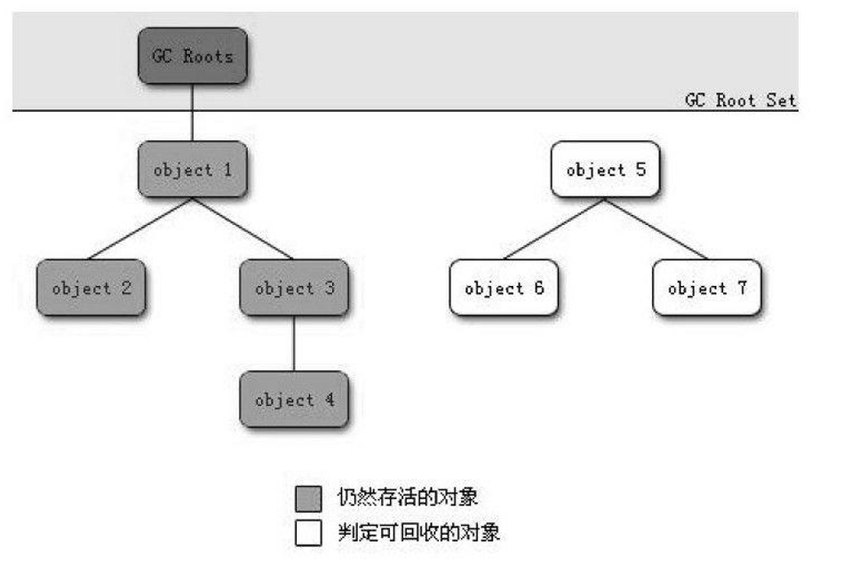
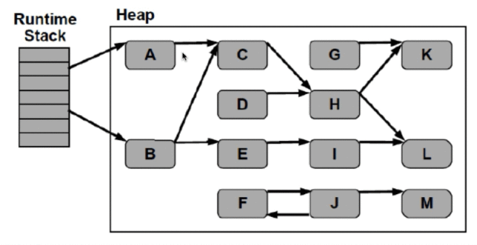
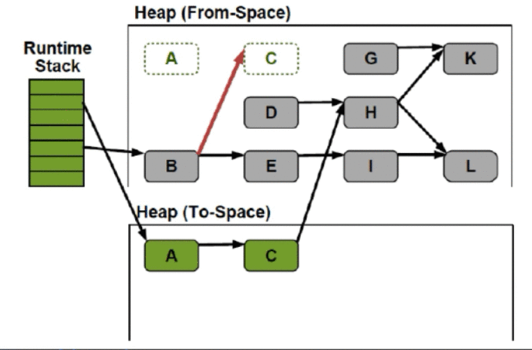
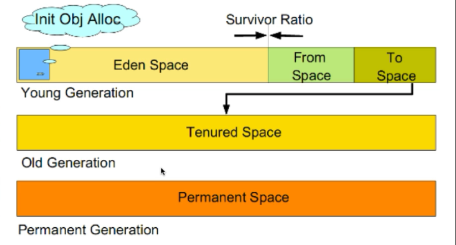
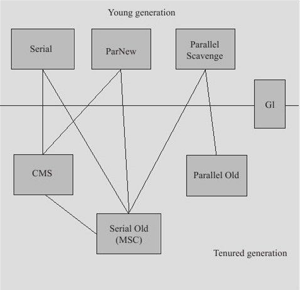
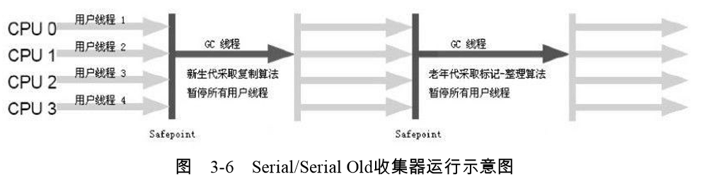
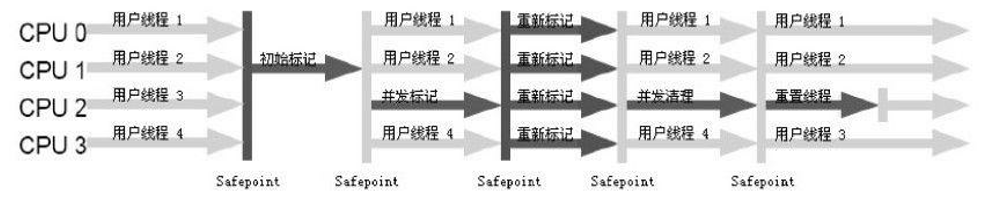

# GC
=====
## 垃圾判断的算法
### 引用计数算法（Reference Counting）
- 给对象添加一个引用计数器，当有一个地方引用它，计数器+1，当引用失效，计数器-1，任何时刻计数器为0的对象就是不可能再被使用的
- 引用计数算法无法解决对象循环引用的问题（循环引用：A引用B，B引用A）

### 根搜索算法（Root Tracing）
- 在实际的生产语言中（Java、C#等），都是使用根搜索算法判定对象是否存活
- 算法的基本思路就是通过一系列的称为“GC Roots”的点作为起始进行向下搜索，当一个对象到GC Roots没有任何引用链（Reference Chain）相连，则证明此对象是不可用的

#### 在Java中 GC Roots包括
- 在VM栈帧中的本地变量的引用
- 方法区中的静态引用
  - JVM规范表示可以不要求虚拟机在**方法区实现GC，性价比比较低**
  - **在堆中**，尤其在新生代，常规应用进行一次GC**一般可以回收70%~95%的空间**
  - 当前商业的JVM都有实现方法区GC，主要回收：**废弃常量和无用类**， 类回收，需要满足以下3个条件
      - 该类**所有的实例都已经被GC**，也就是JVM中不改存在该Class的任何实例
      - 加载该类的**ClassLoader已经被GC**
      - 该类对应的**java.lang.Class对象没有在任何地方被引用**，如不能在任何地方通过反射访问该类的方法
- JNI（一种Native方法）中的引用

## JVM常见的GC算法
- 标记-清除算法（Mark-Sweep）
- 标记-整理算法（Mark-Compact）
- 复制算法（copying）
- 分代算法（Generational）

### 标记-清除算法（Mark-Sweep）
- 算法分为“**标记**”和“**清除**”两个阶段，首先标记出所有需要回收的对象，然后回收所有需要回收的对象
- 缺点：
  - **效率问题**，标记和清理两个过程效率都不高
  - **空间问题**，标记清理之后会产生大量不连续的内存碎片，空间碎片太多可能会导致后续使用中无法找到足够的连续内存而提前触发另一次的垃圾收集动作。

- 将可用内存划分为两块，每次只使用其中的一块，当半区内存用完了，仅将还存活的对象复制到另外一块上面，然后就把原来整块的内存空间，一次性清理掉
- 这样使得每次内存回收都是对这整个半区的回收，内存分配时也就不用考虑内存碎片等复杂情况，只要移动堆顶指针，按顺序分配内存就可以了，实现简单，运行高效。
- **缺点**：这种算法的代价是将内存缩小为原来的一半，代价高昂。

### 复制（Copying）搜集算法
- 现在的商业虚拟机中都是用了这一种手机算法来回收**新生代**
- 将内存分为一块较大的eden空间和2块较少的survivor，每次使用eden和其中的一块survivor，回收时将eden和survivor还存活的对象一次性拷贝到另外一块survivor空间上，然后清理掉eden和用户survivor
- Oracle Hotspot JVM 默认eden和survivor的大小比例是8:1，也就是内次只有10%的内存是浪费的（因为10%浪费，指的是有两个survivor，所以只有一个是生效状态）
- **缺点**：复制收机算法在对象存活率高的时候，效率有所下降
- 如果不想浪费50%的空间，就需要有额外的空间进行分配担保用于应付半区内存中所有对象都100%存活的极端情况，所以在老年代一般不能直接选用这种算法

- 只需要扫描存活的对象，效率更高
- 不会产生碎片
- 需要浪费额外的内存作为复制区
- 复制算法非常适合生命周期比较短的对象，因为每次GC总能回收大部分的对象，复制的开销比较小
- 根据IBM的专i研究，98%的Java对象只会存活1个GC周期，对这些对象很适合用复制算法。而且
  不用1: 1的划分工作区和复制区的空间
### 标记-整理算法（Mark-Compact）
- 标记过程仍然样，但后续步骤不是进行直接清理，而是令所有存活的对象一端移动，然后直接清理掉这端边界以外的内存。
- 没有内存碎片
- 比Mark-Sweep耗费更多的时间进行compact

### 分代收集（Generational Collecting）算法
- 当前商业虚拟机的垃圾收集器都是采用“分代收集”算法，根据对象不同的存活周期将内存划分为几块
- 一般是把Java堆分作，新生代和老年代，这样就可以根据各个年代的特点采用最适当的手机算法，譬如新生代每次GC都有大批对象死去

### Hotspot JVM 6中共划分为三个代:

- 年轻代(Young Generation)
- 老年代(Old Generation)
- 永久代( Permanent Generation)

- 年轻代(Young Generation):新生成的对象都放在新生代。年轻代用复制算法进行GC (理论上年轻代对象的生命周期非常短，所以适合复制算法)
  - 年轻代分三个区。一个Eden区，两个Survivor区(可以通过参数设置Survivor个数)。对象在Eden区中生成。当Eden区满时，还存活的对象将被复制到一个Survivor区，当这个Survivor区满时，此区的存活对象将被复制到另外一个Survivor区，当第二个Survivor区也满了的时候，从第一个Survivor区复制过来的并且此时还存活的对象，将被复制到老年代。2个Survivor是完全对称，轮流替换。
  - Eden和2个Survivor的缺省比例是8:1:1，也就是10%的空间会被浪费。可以根据GClog的信息调整大小的比例

- 老年代(Old Generation)
  - 存放了经过一次或多次GC还存活的对象
  - 一般采用Mark-Sweep或者Mark-Compact算法进行GC
  - 有多种垃圾收集器可以选择。每种垃圾收集器可以看作一个GC算法的具体实现。可以根据具体应用的需求选用合适的垃圾收集器(追求吞吐量?追求最短的响应时间?)

- ~~永久代~~
  - 并不属于堆(Heap).但是GC也会涉及到这个区域
  - 存放了每个Class的结构信息， 包括常量池、字段描述、方法描述。与垃圾收集要收集的Java对象关系不大

### 内存分配
#### 1、堆上分配
- 大多数情况在eden上分配，偶尔会在old上分配，细节取决于GC的实现

#### 2、栈上分配
- 原子类型的局部变量

### 内存回收
#### GC要做的是将那些**消亡**的对象所占用的内存回收掉
- Hotspot认为没有引用的对象就是**消亡**的
- Hotspot将引用分为四种：Strong（强引用）、Soft（软引用）、Weak（弱引用）、Phantom（虚引用）
  - Strong即默认通过Object o=new Object()这种方式赋值的引用
  - Soft、Weak、Phantom这三种则都是继承Reference
- 在Full GC的时候会对Reference类型的引用进行特殊处理
  - Soft：内存不够、长期不用都会被GC
  - Weak：一定会被GC，当被标记为消亡，会在ReferenceQueue中通知
  - Phantom：本来就没引用，当从jvm heap中释放时会通知

---
## 垃圾回收器

#### 在分代模型的基础上，GC从时机上分为两种：Scavenge GC和Full GC
- Scavenge GC（Minor GC）
  - 触发时机：新对象生成时，Eden空间满了
  - 理论上Eden区大多数对象会在Scavenge GC回收，复制算法的执行效率会很高，Scavenge GC时间比较短
- Full GC
  - 对整个JVM进行整理，包括Young、Old、Perm
  - 主要的触发时机：1）Old满了；2）Perm满了；3）system.gc()
  - 效率很低，尽量减少Full GC

#### 垃圾回收器（Garbage Collector）
- 分代模型：GC的宏观愿景
- 垃圾回收器：GC的具体实现

#### 垃圾回收器的“并行”和“并发”
- 并行（Parallel）：只多个收集器的线程同时工作，但是用户线程处于等待状态
- 并发（Concurrent）：指收集器在工作的同时，可以允许用户线程工作。
  - 并发布代表解决了GC停顿的问题，在关键的步骤还是要停顿，比如在收集器标记垃圾的时候，单在清楚垃圾的时候，用户线程可以和GC线程并发执行

### Serial 收集器
- 单线程收集器，收集时会暂停所有工作线程（Stop the world简称 STW），使用复制收集算法，虚拟机运行在Client模式时的默认新生代收集器。
- 最早的收集器，单线程进行GC
- New 和 Old Generation 都可以使用
- 在新生代，采用复制算法；在老年代，采用标记整理算法
- 因为是单线程GC，没有多线程切换的额外开销，简单使用
- Hotspot client模式下默认的收集器

### ParNew 收集器
- ParNew收集器就是Serial的多线程版本，除了使用多个收集线程外，其余行为包括算法、STW、对象、分配规则、回收策略等都与Serial收集器一模一样
- 对应的这种收集器是虚拟机运行在Server模式的默认新生代收集器，在单盒单线程CPU的环境中，ParNew收集器并不会比Serial收集器有更好的效果
- Serial在新生代的多线程版本
- 使用标记复制算法（因为针对新生代）
- 只用在多CPU的环境下，效率才会比Serial收集器高
- 可以用过 -XX:ParallelGCThreads来控制GC线程数的多少。需要结合具体CPU的个数
- Server模式下默认的垃圾收集器

### Parallel Scavenge收集器
- Parallel Scavenge收集器也是一个多线程的收集器，也是使用复制算法，但他的对象分配规则与回收策略都是与parNew收集器有不同，它是以吞吐量最大化（即GC时间占总运行时间最小）为目标的收集器实现，他允许较长时间的STW换区总吞吐量最大化

### CMS（Concurrent Mark Sweep） 收集器
- 以获取最短回收停顿时间为目标，多数应用于互联网站或者B/S系统的服务器端上

- 特点：
  - 追求最短停顿时间，非常适合Web应用
  - 只针对老年区，一般结合ParNew使用
  - Concurrent, GC线程和用户线程并发工作(尽量并发 )
  - Mark-Sweep
  - 只有在多CPU环境下才有意义
  - 使用-XX:+UseConcMarkSweepGC打开

- CMS收集器的缺点
  - CMS以牺牲CPU资源的代价来减少用户线程的停顿。当CPU个数少于4的时候，有可能对吞吐量影响非常大
  - CMS在并发清理的过程中，用户线程还在跑。这时候需要预留一部分空间给用户线程
  - CMS用Mark-Sweep,会带来碎片问题。碎片过多的时候会容易频繁触发FullGC
  - 对于堆比较大的，GC时间难以进行评估
  
- CMS是基于“标记-清除”算法实现的，整个过程分为4个步骤：
    - 初始标记（CMS initial mark）
    - 并发标记（CMS concurrent mark）
    - 重新标记（CMS remark）
    - 并发清除（CMS concurrent sweep）
- 其中，初始标记、重新标记这两个步骤仍然需要STW(stop the world)
- 初始标记只是标记一下GC Roots能直接关联到的对象，速度很快
- 并发标记阶段就是进行 GC Roots Tracing的过程
- 重新标记阶段则是为了修正并发标记期间因用户程序继续运作而导致标记产生变动的那一部分对象的标记记录，这个阶段的停顿时间一般会比初始标记阶段稍长一些，但远比并发标记的时间短

- 空间分配担保：在发生Monor GC 之前，虚拟机会先检查老年代最大可用的联系空间是否大于新生代所有对象的总空间，如果这个条件成立，那么Minor GC可以确保是安全的，当大量对象在Minor GC可以后仍然存活，就需要老年代进行空间分配担保，把Survivor无法容纳的对象直接进入老年代，如果老年代判断到剩余空间不足（根据每次回收晋升到老年代对象的大小来计算）则进行一次Full GC

