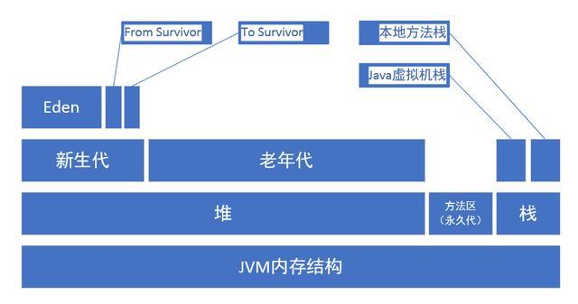
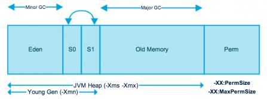
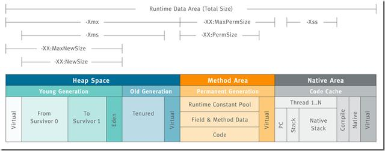
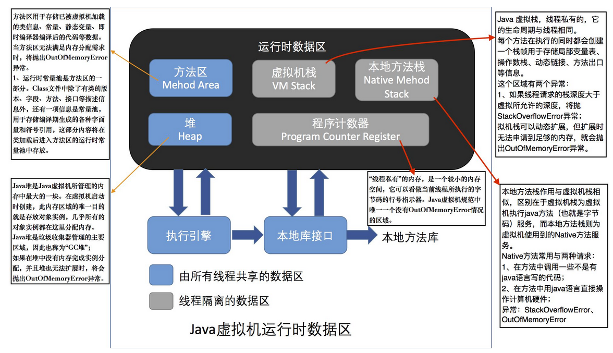

# JVM内存模型
==================
## JVM 内存模型
> 对于大多数应用来说，Java 堆（Java Heap）是Java 虚拟机所管理的内存中最大的一块。Java 堆是被所有线程共享的一块内存区域，在虚拟机启动时创建。

### JVM内存结构
     
由上图可以清楚的看到JVM的内存空间分为3大部分
- 1：堆内存
    - 新生代
        - Eden区
        - From Survivor区
        - To Survivor区
    - 老年代
- 2：方法区
- 3：栈内存
    - java虚拟机栈
    - 本地方法栈

> 其中一部分是线程共享的:**Java堆**和**方法区**；另一部分是线程私有的：**虚拟机栈**和**本地方法栈**,以及**程序计数器**这一小部分内存

#### 堆内存（Heap）
- 对于大多数应用程序来说，Java堆（Java Heap）是JVM所管理的内存中最大一块，Java堆是被所有线程共享的一块内存区域，在JVM启动时创建。
- 此内存区域的唯一目的就是**存放对象实例**，几乎所有的对象实例都在这里分配内存
- 堆内存是所有线程共有的，可分为两部分：年轻代、老年代

下图中的Perm代表永久代，但是注意永久代并不属于堆内存的一部分，同事JDK1.8后永久代被移除变为元数据区



- 新生代（Young）与老年代（Old）的比例值为1:2（该值通过参数 ``-XX：NewRatio``来指定）
- 默认的 Eden：form：to = 8:1:1（可以通过 `` –XX:SurvivorRatio``来设定），即： Eden = 8/10 的新生代空间大小，from = to = 1/10 的新生代空间大小。

#### 方法区（Method Area）
- 方法区也叫“永久代”，它用于存储虚拟机加载的类信息、常量、静态变量、是各个线程共享的内存区域
- 在JDK8之前的HotSpot JVM，存放这些“永久的”的区域叫做“永久代（permanent generation）”，永久代是一片连续的堆空间，可以通过``XX:MaxPermSize``来设定永久代最大可分配的内存空间，默认大小是64M（64位JVM默认是85M）
- 随着JDK8的到来，JVM不再有永久代(PermGen)，但类的元数据信息（metadata）还在，只不过不再存储在连续的堆空间上，而是移动到叫做“MetaSpace”的本地内存（Native memory）
- 方法区或永生代相关设置
````xml
-XX:PermSize=64MB 最小尺寸，初始分配
-XX:MaxPermSize=256MB 最大允许分配尺寸，按需分配
-XX:+CMSClassUnloadingEnabled -XX:+CMSPermGenSweepingEnabled 设置垃圾不回收默认大小
-server选项下默认MaxPermSize为64m
-client选项下默认MaxPermSize为32m
````

#### 虚拟机栈(JVM Stack)
- 描述的是Java执行的方法的内存模型：每个方法被执行的时候都会创建一个"栈帧"，用于存储局部变量表（包括参数）、操作栈、方法出口信息。每个方法被调用到执行完的过程，就对应着一个栈帧在虚拟机栈中从入栈导出栈的过程。

#### 本地方法栈(Native Stack)
- 本地方法栈与虚拟机方法栈锁发挥的作用相似，其区别不过是虚拟机栈为虚拟机执行Java方法（也就是字节码）服务，而本地方法栈则是为虚拟机使用到Native方法服务

#### 程序计数器（PC Register）

- 程序计数器是用于标识当前线程执行的字节码文件的行号指示器。多线程情况下，每个线程都具有各自独立的程序计数器，所以该区域是非线程共享的内存区域。

- 当执行java方法时候，计数器中保存的是字节码文件的行号；当执行Native方法时，计数器的值为空。

#### 直接内存

- 直接内存并不是虚拟机内存的一部分，也不是Java虚拟机规范中定义的内存区域。jdk1.4中新加入的NIO，引入了通道与缓冲区的IO方式，它可以调用Native方法直接分配堆外内存，这个堆外内存就是本机内存，不会影响到堆内存的大小。

## JVM 参数设置

- -Xms设置堆的最小空间大小。
- -Xmx设置堆的最大空间大小。
- -Xmn:设置年轻代大小
- -XX:NewSize设置新生代最小空间大小。
- -XX:MaxNewSize设置新生代最大空间大小。
- -XX:PermSize设置永久代最小空间大小。
- -XX:MaxPermSize设置永久代最大空间大小。
- -Xss设置每个线程的堆栈大小
- -XX:+UseParallelGC:选择垃圾收集器为并行收集器。此配置仅对年轻代有效。即上述配置下,年轻代使用并发收集,而年老代仍旧使用串行收集。
- -XX:ParallelGCThreads=20:配置并行收集器的线程数,即:同时多少个线程一起进行垃圾回收。此值最好配置与处理器数目相等。

典型JVM参数配置参考:
````xml
java-Xmx3550m-Xms3550m-Xmn2g-Xss128k
-XX:ParallelGCThreads=20
-XX:+UseConcMarkSweepGC-XX:+UseParNewGC
````
- -Xmx3550m:设置JVM最大可用内存为3550M。
- -Xms3550m:设置JVM促使内存为3550m。此值可以设置与-Xmx相同,以避免每次垃圾回收完成后JVM重新分配内存。
- -Xmn2g:设置年轻代大小为2G。整个堆大小=年轻代大小+年老代大小+持久代大小。持久代一般固定大小为64m,所以增大年轻代后,将会减小年老代大小。此值对系统性能影响较大,官方推荐配置为整个堆的3/8。
- -Xss128k:设置每个线程的堆栈大小。JDK5.0以后每个线程堆栈大小为1M,以前每个线程堆栈大小为256K。更具应用的线程所需内存大 小进行调整。在相同物理内存下,减小这个值能生成更多的线程。但是操作系统对一个进程内的线程数还是有限制的,不能无限生成,经验值在3000~5000 左右。

### 创建对象并分配内存
Java堆是被所有线程共享的一块内存区域，主要用于存放对象实例，为对象分配内存就是把一块大小确定的内存从堆内存中划分出来，通常有指针碰撞和空闲列表两种实现方式。

- 1.**指针碰撞法**：
假设Java堆中内存时完整的，已分配的内存和空闲内存分别在不同的一侧，通过一个指针作为分界点，需要分配内存时，仅仅需要把指针往空闲的一端移动与对象大小相等的距离。使用的GC收集器：Serial、ParNew，适用堆内存规整（即没有内存碎片）的情况下。

- 2.**空闲列表法**：
事实上，Java堆的内存并不是完整的，已分配的内存和空闲内存相互交错，JVM通过维护一个列表，记录可用的内存块信息，当分配操作发生时，从列表中找到一个足够大的内存块分配给对象实例，并更新列表上的记录。使用的GC收集器：CMS，适用堆内存不规整的情况下。

### JVM内部结构


```java
/**
 * Created BY poplar ON 2019/11/25
 * 关于Java对象创建的过程:
 * new关键字创建对象的3个步骤:
 * 1.在堆内存中创建出对象的实例。
 * 2.为对象的实例成员变量赋初值。
 * 3.将对象的引用返回
 * 指针碰撞(前提是堆中的空间通过一个指针进行分割，一侧是已经被占用的空间，另一侧是未被占用的空间)
 * 空闲列表(前提是堆内存空间中已被使用与未被使用的空间是交织在一起的，这时，虚拟机就需要通过一个列表来记录哪些空间是可以使用的，
 * 哪些空间是已被使用的，接下来找出可以容纳下新创建对象的且未被使用的空间，在此空间存放该对象，同时还要修改列表上的记录)
 * 对象在内存中的布局:
 * 1.对象头.
 * 2.实例数据(即我们在一个类中所声明的各项信息)
 * 3.对齐填充(可选) !
 * 引用访问对象的方式:
 * 1.使用句柄的方式。
 * 2.使用直接指针的方式。
 */
public class MemoryTest1 {
    public static void main(String[] args) {
        //-Xms5m -Xmx5m -XX:+HeapDumpOnOutOfMemoryError 设置jvm对空间最小和最大以及遇到错误时把堆存储文件打印出来
        //打开jvisualvm装在磁盘上的转存文件
        List<MemoryTest1> list = new ArrayList<>();
        while (true) {
            list.add(new MemoryTest1());
            System.gc();
        }
    }
}
```

### 虚拟机栈溢出测试

```java
/**
 * Created BY poplar ON 2019/11/25
 * 虚拟机栈溢出测试
 */
public class MemoryTest2 {

    private int length;

    public int getLength() {
        return length;
    }

    public void test() throws InterruptedException {
        length++;
        Thread.sleep(1);
        test();
    }

    public static void main(String[] args) {
        //测试调整虚拟机栈内存大小为：  -Xss160k，此处除了可以使用JVisuale监控程序运行状况外还可以使用jconsole
        MemoryTest2 memoryTest2 = new MemoryTest2();
        try {
            memoryTest2.test();
        } catch (Throwable e) {
            System.out.println(memoryTest2.getLength());//打印最终的最大栈深度为：2587
            e.printStackTrace();
        }
    }
}
```

###  元空间溢出测试

```java
/**
 * Created BY poplar ON 2019/11/26
 * 元空间内存溢出测试
 * 设置元空间大小：-XX:MaxMetaspaceSize=100m
 * 关于元空间参考：https://www.infoq.cn/article/java-permgen-Removed
 */
public class MemoryTest3 {
    public static void main(String[] args) {
        //使用动态代理动态生成类
        while (true) {
            Enhancer enhancer = new Enhancer();
            enhancer.setSuperclass(MemoryTest3.class);
            enhancer.setUseCache(false);
            enhancer.setCallback((MethodInterceptor) (obj, method, ags, proxy) -> proxy.invokeSuper(obj, ags));
            System.out.println("Hello World");
            enhancer.create();// java.lang.OutOfMemoryError: Metaspace
        }
    }
```

### JVM命令使用

```java
/**
 * Created BY poplar ON 2019/11/26
 * jmam命令的使用 -clstats<pid>进程id  to print class loader statistics
 * jmap -clstats 3740
 *
 * jstat -gc 3740
 *  S0C    S1C    S0U    S1U      EC       EU        OC         OU       MC     MU    CCSC   CCSU   YGC     YGCT    FGC    FGCT     GCT
 * 512.0  512.0   0.0    0.0   24064.0   9626.0   86016.0     1004.1   4864.0 3758.2 512.0  409.1     144    0.064   0      0.000    0.064
 * MC元空间总大小，MU元空间已使用的大小
 */
public class MemoryTest4 {
    public static void main(String[] args) {
        while (true)
            System.out.println("hello world");
    }
    //查看java进程id jps -l
    // 使用jcmd查看当前进程的可用参数：jcmd 10368 help
    //查看jvm的启动参数 jcmd 10368 VM.flags
   // 10368:-XX:CICompilerCount=3 -XX:InitialHeapSize=132120576 -XX:MaxHeapSize=2111832064 -XX:MaxNewSize=703594496
    // -XX:MinHeapDeltaBytes=524288 -XX:NewSize=44040192 -XX:OldSize=88080384 -XX:+UseCompressedClassPointers
    // -XX:+UseCompressedOops -XX:+UseFastUnorderedTimeStamps -XX:-UseLargePagesIndividualAllocation -XX:+UseParallelGC

}
```


### JVM常用命令

```java
jcmd (从JDK 1. 7开始增加的命令)
1. jcmd pid VM.flags: 查看JVM的启动参数
2. jcmd pid help: 列出当前运行的Java进程可以执行的操作
3. jcmd pid helpJFR.dump:查看具体命令的选项
4. jcmd pid PerfCounter.print:看JVm性能相关的参数
5. jcmd pid VM.uptime:查有JVM的启动时长
6. jcmd pid GC.class_ histogram: 查看系统中类的统计信息
7. jcmd pid Thread.print: 查看线程堆栈信息
8. jcmd pid GC.heap dump filename 导出Heap dump文件， 导出的文件可以通过jvisualvm查看
9. jcmd pid VM.system_ properties:查看JVM的属性信息

```