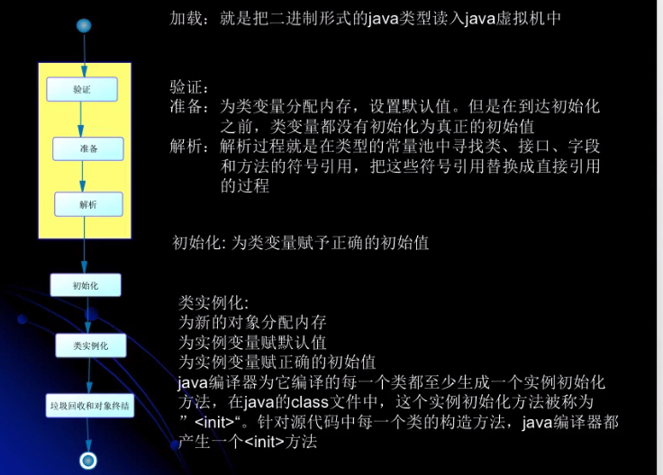
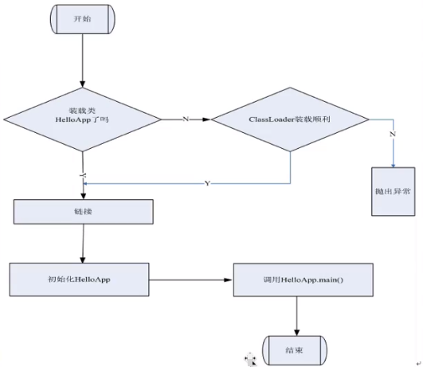
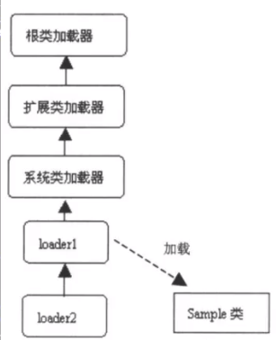

# 类加载
## 类的加载、连接、初始化
#### 在Java代码中，类型的加载、连接、初始化过程都是在程序运行期间完成的
- 类的加载：
  - 把编译好的字节码（**.class文件**）的二进制数据加载到**内存中**，将其放在**运行时数据区的方法区内**，然后创建一个`java.lang.Class`对象，用来封装类在方法区内的数据
  >ps:规范并未说明Class对象位于哪里，HotSpot虚拟机将其放在了方法区中 
  >无论一个类创建了多少个对象，在方法区内都是一个Class对象
  - 加载.class文件的方式
    - 从本地系统中直接加载
    - 通过网络下载.class文件
    - 从Zip、jar等对党文件中加载.Class文件
    - 从数据库中提取.Class文件
    - 将Java源文件动态编译为.Class文件(场景：动态代理、反射)
- 链接：就是将已经读入到内存的类的二进制数据合并到虚拟机的运行时环境中去。
    - 验证：确保被加载的类的正确性
      - 类文件的结构检查
      - 语义检查
      - 字节码验证
      - 二进制兼容性的验证
    - 准备：为类的**静态变量**分配内存，并将其初始化为**默认值**
    - 解析：**把类中的符号引用转换为直接引用**
- 初始化：
  - 静态变量的声明语句，以及静态代码块
  - 初始化顺序自上而下，详情请参考`ClassLoadTest_7`
  - 初始化一个类时，要求他的所有父类都已经被初始化，单这条规则不适用于接口
    - 在初始化一个类时，并不会先初始化他所实现的接口
    - 在初始化一个接口时，并不会先初始化他的父接口
  - 类得到初始化步骤
    - 1: 假如类没有被加载和链接，先进行加载和链接
    - 2：假如类存在直接父类，并且这个父类还没有被初始化，那就先初始化直接父类
    - 3：假如勒种存在初始化语句，那就一次执行这些初始化语句（静态变量、静态代码块）

>PS：静态变量在加载的时候，先赋值默认初始值。即int类型赋值0等，然后再赋值代码中的值，
>参考https://www.cnblogs.com/chafanbusi/p/10639757.html

#### 类的实例化
- 1：为对象分配内存
- 2：为实例变量赋默认值
- 3：为实例变量赋初始值（初始值指的是代码中写的值）

**类初始化时序图**

#### Java虚拟机与程序的生命周期
- 在如几种情况，Java虚拟机将结束生命周期
    - 执行了`System.exit()`方法
    - 程序正常执行结束
    - 程序子执行过程中有了异常或错误而异常终止
    - 由于操作系统出现错误而导致Java虚拟机进程终止

#### Java程序对类的使用方式可分为两种
- 主动使用（**7种**）
  - 创建类的实例
  - 访问某个类或接口的静态变量（助记符：`getStatic`），或者对该静态变量赋值（助记符：`putStatic`）
  - 调用类的静态方法（助记符：`invokeStatic`）
  - 反射（如：`Class.forName("com.cui.TestClass")`）
  - 初始化一个类（P）的子类（S），那么也会对（P）主动使用
  - Java虚拟机启动时被标记为启动的类（JUnit test、Main方法）
  - JDK7 开始提供的动态语言支持：`java.lang.invoke.MethodHandle`实例的解析结果（REF_getStatic、REF_putStatic、REF_invokeStatic）句柄对应的类没有初始化则初始化。ps：很少接触到
- 被动使用
  >除了以上7种情况，都看作是被动使用，都不会对类的初始化，但不代表不对类进行加载、连接。 
  代码请参考：ClassLoadTest_1、ClassLoadTest_2

#### 类必须在被Java程序“首次主动使用”时，虚拟机才初始化他们
#### 类加载器

- 有两种类型的类加载器
  - java虚拟机自带的加载器
    - **根类加载器**（Bootstrap）：该加载器没有父加载器，它负责加载虚拟机中的核心类库。根类加载器从系统属性sun.boot.class.path所指定的目录中加载类库。类加载器的实现依赖于底层操作系统，属于虚拟机的实现的一部分，它并没有集成java.lang.ClassLoader类。
    - **扩展类加载器**（Extension）：它的父加载器为根类加载器。它从java.ext.dirs系统属性所指定的目录中加载类库，或者从JDK的安装目录的jre\lib\ext子目录（扩展目录）下加载类库，如果把用户创建的jar文件放在这个目录下，也会自动由扩展类加载器加载，扩展类加载器是纯java类，是java.lang.ClassLoader的子类。
    - **系统应用类加载器**（AppClassLoader/System）：也称为应用类加载器，它的父加载器为扩展类加载器，它从环境变量classpath或者系统属性java.class.path所指定的目录中加载类，他是用户自定义的类加载器的默认父加载器。系统类加载器时纯java类，是java.lang.ClassLoader的子类。

  - 用户自定义的类加载器
    - java.lang.ClassLoader的子类
    - 用户可以定制类的加载方式

    > **根类加载器–>扩展类加载器–>系统应用类加载器–>自定义类加载器** 
      

- 类加载器并不需要等到某个类**被主动使用**的时候才会加载他

- 双亲委托机制
> 类加载器用来把类加载到Jvm中，从1.2开始类加载过程采用**父亲委托机制**，可以更好的保证JAVA平台的安全，再次委托机制中，除了Jvm自带的根类加载器以外，其余的类加载器都有且只有一个父加载器。当java陈旭请求加载器loader1加载Sample类时，loader1首先委托自己的父加载器去加载Sample类，如果父加载器能做则由父加载器来做，否则loader1自己来加载

> JVM规范允许类加载器在预料某个类将要被使用时就预先加载它，如果在预先加载的过程中遇到了.class文件缺失或存在错误，类加载器必须在**程序首次主动**使用该类时才报告错误（LinkageError错误）

> 如果这个类一直没有被程序主动使用，那么**类加载器就不会报告错误**
